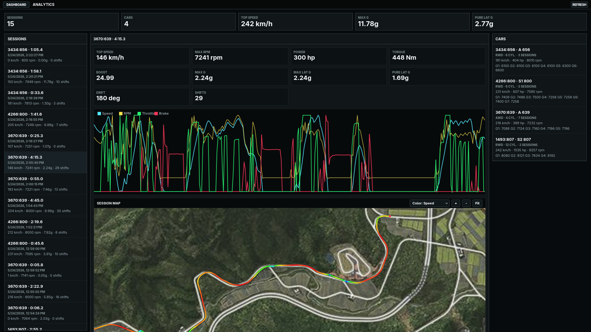

# forza-tacho

A real-time tachometer overlay for Forza Horizon 6 — with a shift light that actually learns your car.




## Agenda

- [What is this?](#what-is-this)
- [Quick start](#quick-start--just-want-to-play)
- [Dashboard field reference](#dashboard-field-reference)
- [How the shift light works](#how-the-shift-light-works)
- [Command-line options](#command-line-options)
- [Data storage](#data-storage)
- [Session Map + Calibration](#session-map--calibration)
- [Analytics](#analytics)
- [Building from source](#building-from-source)
- [Technical deep-dive](#technical-deep-dive-the-shift-algorithm)
- [Releases](#releases)

---

## What is this?

forza-tacho runs in the background while you play Forza.  
It shows you a **shift indicator** that tells you exactly when to upshift for maximum power — not just "shift at 80% RPM", but the real optimal point for each car, learned from how you drive it.

You get:
- A **shift light overlay** you can drag anywhere on screen
- A **dashboard** in your browser with RPM, speed, gear, G-forces, lap times and more
- The dashboard works on **any device on the same network** — open it on a tablet or old phone, prop it up next to your monitor, or mount it behind your wheel as a second display. It also installs as a **web app (PWA)** so it looks and feels like a native app with no browser chrome in the way.

---

## Quick start — just want to play?

### 1. Download and open

Go to the **[Releases](../../releases)** page and download the right file for your system:

- **Windows:** `forza-tacho.exe` — double-click it. A small window opens, that's the launcher.
- **Linux:** `forza-tacho-linux-x86_64` — make it executable (`chmod +x`) and run it.  
  Works on any x86-64 desktop distro: Ubuntu, Fedora, Arch, CachyOS, Bazzite, Nobara, and others.
- **macOS:** `forza-tacho-macos` — same as Linux. One file that runs natively on both Intel Macs and Apple Silicon (M1/M2/M3) — no separate downloads.

---

### 2. Set up Forza

In Forza Horizon 6, go to:

**Settings → HUD and Gameplay → Data Out**

| Setting | Value |
|---|---|
| Data Out | **On** |
| Data Out IP Address | the IP shown in the forza-tacho window |
| Data Out IP Port | **5300** |

The IP address is shown right in the launcher window — there's a copy button next to it.

> **forza-tacho doesn't have to run on the same PC as Forza.**  
> You can run it on any machine on the same network — a spare laptop, a Raspberry Pi, whatever.  
> Point Forza's Data Out at that machine's IP, and open the dashboard from anywhere on the network.

> **Privacy mode:**
> In the launcher settings you can enable **Local-only mode**. After restart, HTTP and UDP bind to `127.0.0.1`, so the dashboard is only reachable from the same PC and is not exposed on your LAN.

---

### 3. Open the dashboard

Click "Open in browser" in the launcher, or type the URL shown there into any browser on your network.

> **Second screen / tablet:**  
> The dashboard runs in the browser, so you can open it on a completely separate device.  
> A tablet propped up next to your monitor works great — or clamp one behind your steering wheel for a proper sim-racing cockpit feel.  
> On mobile you can install it as an app: tap *Share → Add to Home Screen* (iOS) or the install prompt in Chrome (Android), and it opens fullscreen without any browser UI.

---

### 4. Optional: shift LED overlay

In the launcher, toggle "Show overlay".  
A small row of coloured dots appears on screen — drag it wherever you want.  
It sits on top of the game and shows the shift indicator in real time.

Right-click the overlay to close it.

---

## Dashboard field reference

<details>
<summary>Open dashboard field legend</summary>

The web dashboard (and the launcher's **Help & field legend** section) shows the following fields.

### Main displays

| Field | What it means |
|---|---|
| **RPM** | Engine revolutions per minute. |
| **Speed** | Vehicle speed in km/h. |
| **Gear** | Current gear. 0 = neutral, negative = reverse. |
| **Power** | Estimated wheel power output at the current RPM (hp). |
| **Torque** | Engine torque at the current RPM (Nm). |
| **Boost** | Turbo / supercharger boost pressure. |
| **Lap / Time / Best** | Lap number, elapsed lap time, and fastest completed lap this session. |
| **Pos** | Race position — only populated in structured events. |

### Control strip (right side)

| Label | Full name | What it shows |
|---|---|---|
| **GAS** | Throttle | Accelerator pedal, 0–100 %. |
| **BRK** | Brake | Brake pedal, 0–100 %. |
| **STR** | Steering | Steering wheel position, −1.0 (full left) to +1.0 (full right). |
| **DLT** | Lap delta | Time gap to your best lap. Green = currently faster, red = slower. |
| **PROG** | Lap progress | How far through the current lap you are, as a percentage. |

### Data strip

| Label | Full name | What it shows |
|---|---|---|
| **LAT** | Lateral G | Left/right cornering load in G. |
| **LON** | Longitudinal G | Acceleration / braking load in G. |
| **DRV** | Drivetrain | FWD, RWD, or AWD. |
| **FUEL** | Fuel level | Percentage (≤ 100 %) or litres when > 1.2. |

### G-force meter

The dot on the G-meter moves in two dimensions — left/right for lateral load, up/down for longitudinal.  
The `p` suffix (e.g. `1.23p`) is the **peak** value recorded since you started driving.

### Drift display

| Element | What it shows |
|---|---|
| Angle (deg) | Estimated side-slip angle in degrees. |
| Sliding bar | Live slip angle visualised as a needle. |
| `Np` number | **Peak** drift angle seen this session. |

### Tyre corners (FL / FR / RL / RR)

**FL** = Front Left, **FR** = Front Right, **RL** = Rear Left, **RR** = Rear Right.

- **Temperature box** — tyre surface temperature in °C. Colour shifts from blue (cold) through green (optimal) to red/white (overheating).
- **Slip LED strip** (5 dots per corner, shown around the edge of the display) — how hard that tyre is working. Fills from 0 to full as combined slip increases. All dots lit = significant wheelspin or lockup.

### Warning indicators

Eight labels light up around the shift LEDs when certain conditions are met:

| Label | Full name | When it lights up |
|---|---|---|
| **US** | Understeer | Front tyres losing grip more than rears while you are steering. The car is pushing wide. |
| **OS** | Oversteer | Rear tyres losing grip more than fronts while you are steering. The rear is stepping out. |
| **B/T** | Brake/Throttle overlap | You are pressing both the brake and the throttle at the same time (both > 8 %). |
| **TMP** | Tyre temperature | At least one tyre has exceeded 105 °C — grip noticeably degrades above this point. |
| **ABS** | ABS active | Anti-lock braking system is intervening (hard braking with front slip detected). |
| **LOCK** | Wheel lock | A front wheel has locked up under hard braking. |
| **CL** | Clutch | The clutch pedal is pressed (> 8 %). |
| **HB** | Handbrake | The handbrake is on (> 8 %). |

### Shift LED colours

| Colour | Meaning |
|---|---|
| 🟢 Green (LEDs 1–4) | RPM building — shift point not yet near. |
| 🟡 Yellow (LEDs 5–8) | Approaching the shift point. |
| 🔴 Red (LEDs 9–11) | Getting close — prepare to shift. |
| 🟣 Purple (LEDs 12–14) + flash | **Shift NOW.** All LEDs flash rapidly until you upshift. |

### Other

| Label | What it means |
|---|---|
| **Ordinal** | Forza's internal car identifier. Unique per model variant, used to key stored curve data. |
| **PI** | Performance Index — the car's class rating (100–999, e.g. 900 = X class). |
| **Shift point** | The RPM the shift indicator is targeting for this car. Learned from your driving; see *How the shift light works* below. |

</details>

---

## How the shift light works

<details>
<summary>Open shift-light overview</summary>

The indicator goes through several stages as you drive more.

**Stage 1 — First drive, no data yet**  
Uses a conservative estimate: warns slightly early rather than letting you hit the limiter.

**Stage 2 — Learning your rev limit**  
After a few laps the app has seen your car's actual RPM ceiling and refines the warning accordingly.

**Stage 3 — Rev limiter detection**  
If you hold full throttle at the limiter, the app detects the characteristic RPM oscillation and locks in the exact limit.

**Stages 4–7 — Power curve and optimal shift point**  
On full-throttle runs the app builds a power curve for your car (per car, per tune).  
Once it has enough data, it calculates the RPM where shifting to the next gear actually gives *more* power than staying — and that's when the light fires.  
Lead time is compensated dynamically so the light fires early enough for you to react.

All data is saved per car, so the second time you drive the same vehicle everything is already there.

</details>

---

## Command-line options

<details>
<summary>Open CLI reference</summary>

These are all optional — the defaults work out of the box.

```
forza-tacho [OPTIONS]

Options:
  --http-host <HOST>           Address to bind the web server [default: 0.0.0.0]
  --http-port <PORT>           Web server port [default: 8765]
  --udp-host <HOST>            Address for Forza UDP packets [default: 0.0.0.0]
  --udp-port <PORT>            UDP port [default: 5300]
  --demo                       Run a simulated car (no Forza needed)
  --debug                      Enable debug-only analytics map calibration tools
  --no-gui                     Terminal-only mode, no window
  --inspect                    Log raw UDP packets to disk
  --inspect-dir <DIR>          Directory for packet logs [default: logs]
  --inspect-every <N>          Log every Nth packet [default: 30]
  --shift-cache-log            Write shift decisions to a JSONL log
  --shift-cache-log-dir <DIR>  Directory for shift logs [default: logs]
  --limiter-log                Print limiter-detection events to stdout
  --limiter-debug              Verbose per-packet limiter debug log
  -h, --help                   Print help
```

</details>

---

## Data storage

<details>
<summary>Open data layout</summary>

Everything is written next to the executable:

```
forza-tacho(.exe)
data/
  power_curves.json     <- learned shift points, one entry per car
  drive_sessions/       <- one .jsonl file per session
  map_calibration.json  <- map calibration points for world->image alignment
  launcher_config.json  <- launcher preferences, including Local-only mode
logs/                   <- only created with --inspect or --shift-cache-log
```

Deleting `data/` resets all learned shift data.
If `data/map_calibration.json` does not exist yet, the embedded default calibration from `static/map_calibration.default.json` is used.

</details>

## Session Map + Calibration

<details>
<summary>Open map and calibration workflow</summary>

- Open analytics at `http://<host>:8765/analytics.html` and select a session.
- There is no separate map tab anymore; map features are integrated into analytics (`/map.html` redirects to `/analytics.html`).
- Session tracks are drawn from recorded world positions in `drive_sessions`.
- Track coloring modes are available: `Plain`, `Speed`, `Drift`, `Slip`, `G Lat`, `G Total`.
- Start the app with `--debug` to enable calibration tools inside analytics.
- In calibration mode you can:
  - capture your current car world position,
  - click the matching point on the map image,
  - repeat with multiple points,
  - save calibration to `data/map_calibration.json`.
- The analytics map supports pan + zoom (`wheel`, `+`, `-`, `Fit`) for precise point placement.
- Calibration supports `Flip X` / `Flip Z` toggles for mirrored axis cases.

</details>

## Analytics

<details>
<summary>Open analytics feature list</summary>

- Session detail now includes the map directly under the charts (`/analytics.html`).
- Map coloring supports: `Plain`, `Speed`, `Drift`, `Slip`, `G Lat`, `G Total`.
- Analytics includes the full map workflow (track view + calibration in debug mode).
- Replay controls let you play a recorded session back through the chart and map marker.
- Car analysis compares learned shift points against the standard fallback shift target.
- Track line width is rendered with constant on-screen pixel thickness while zooming.
- Analytics layout uses slimmer side panes, a wider center pane, and a taller map canvas for better large-screen usability.
- Session stats now include:
  - `Pure Lat G` (lateral peak while longitudinal/brake/accel influence is low)

</details>

---

## Overlay on KDE Wayland

<details>
<summary>Open KDE Wayland setup</summary>

On KDE Wayland the compositor ignores the app-level "always on top" flag by default.  
Fix it with a window rule:

1. **System Settings → Window Management → Window Rules**
2. **+ Add New** — Window class: `forza-tacho`
3. Add property: **Keep above** → Force → Yes
4. Add property: **Virtual Desktop** → Force → All Desktops
5. **Apply** — takes effect immediately, no restart needed

</details>

---

## Performance

<details>
<summary>Open performance notes</summary>

Forza streams telemetry at 60 packets/second (~324 bytes each).

| Metric | Value |
|---|---|
| Processing time per packet | **< 1 ms** |
| Resident memory | **~10–15 MB** |
| CPU during active play | **< 1%** |
| External dependencies at runtime | **Zero** — single binary |

Disk writes happen only when the power curve is updated (~every 0.3 s during learning, idle otherwise). Saves are atomic (write to `.tmp`, then rename) so a crash never corrupts stored data.

</details>

---

## Releases

Releases are published on GitHub Releases. Build and publishing are handled by CI workflows.

---

## Building from source

<details>
<summary>Open build instructions</summary>

You need [Rust](https://rustup.rs/) installed.

```bash
# debug build
cargo run

# optimised release build
cargo build --release
```

### Linux system dependencies

The GUI requires a few system libraries. On Debian/Ubuntu:

```bash
sudo apt install libxkbcommon-dev libwayland-dev libegl-dev libgl1-mesa-dev
```

On Fedora these are typically already present on a desktop install.

### macOS universal binary

The CI builds two separate binaries — one for Intel (`x86_64-apple-darwin`) and one for Apple Silicon (`aarch64-apple-darwin`) — then merges them into a single file using `lipo`. The result runs natively on both without Rosetta.

### Cross-compiling for Windows (from Linux)

CI uses a native Windows runner, but local cross-compilation also works:

```bash
rustup target add x86_64-pc-windows-gnu
sudo dnf install mingw64-gcc        # Fedora
# sudo apt install gcc-mingw-w64    # Debian / Ubuntu

cargo build --release --target x86_64-pc-windows-gnu
# -> target/x86_64-pc-windows-gnu/release/forza-tacho.exe
```

The `.exe` is fully self-contained — no extra files needed alongside it.

</details>

---

## Technical deep-dive: the shift algorithm

<details>
<summary>Click to expand</summary>

### Stage 1 — Safety fallback

Before any real data exists, the engine limit is estimated at **94 % of Forza's reported `maxRpm`**. The shift warning fires at this limit minus a lead gap proportional to the usable RPM band. Gears 1–3 get tighter safety ratios (98–99 %) and slightly longer lead times because RPM builds fastest there.

### Stage 2 — Observed rev limit

Every full-throttle pass in a forward gear updates `maxObservedRpm`. This is capped at **97 % of `maxRpm`** to prevent a single RPM spike from collapsing the safety margin. The value is persisted between sessions.

### Stage 3 — Limiter bounce detection

When holding full throttle at the limiter, Forza's engine simulation oscillates RPM in a characteristic pattern. The app detects this by counting *direction reversals*:

1. Track the local peak while RPM rises.
2. Once RPM drops ≥ 30 RPM from that peak (but < 400 RPM — larger drops are upshifts), record a reversal.
3. After **3 reversals within 1 second**, the limiter is confirmed.

If the confirmed limiter is more than 1.5 % *below* the stored value, all shift points for that car are recalculated.

### Stage 4 — Power curve learning

On every full-throttle pass (throttle ≥ 99 %, brake ≤ 2 %) the app samples power output and groups it into **100-RPM buckets**, keeping the *maximum* seen per bucket. At least **6 filled buckets** are needed before the learned shift algorithm activates.

The curve is saved atomically every 20 samples.

### Stage 5 — Gear drop ratio

Forza doesn't expose gear ratios directly, so the app measures them from your actual shifts.  
When an upshift is detected (gear increases by exactly 1 within 0.8 s):

```
drop_ratio = rpm_after / rpm_before
```

Ratios outside 0.35–0.92 are discarded. Valid ratios are averaged with equal weight; a running weighted mean lets later, more accurate samples refine earlier ones.

### Stage 6 — Optimal shift point

Once both the power curve (≥ 6 buckets) and at least one gear drop ratio are available:

1. Find the **power peak RPM**.
2. For every RPM above the peak, simulate an upshift: `rpm_after = current × drop_ratio`.
3. Look up `power_after` via linear interpolation.
4. The first RPM where `power_after ≥ current_power × 1.005` is the shift point.

The 0.5 % threshold prevents premature shifts on flat power curves (EVs, turbo plateau, noisy data). If no such point exists, the safety limit is used.

### Stage 7 — Dynamic shift warning

The indicator fires *early* to compensate for reaction time:

```
warning_rpm = shift_rpm − clamp(rpm_rate × 0.20s, 100, 800)
```

`rpm_rate` is a smoothed measurement of how fast RPM is currently climbing, tracked per gear. If the rate is outside a plausible range (e.g. you're cruising), a fallback gap of 1.2 % of shift RPM is used instead.

### Cache validation

Cached shift points are validated live: if measured power deviates more than 15 % from the stored curve, the entry is invalidated and recomputed. Once deviation stays below 5 %, the entry is marked *validated*.

Car identity is keyed on `ordinal:performanceIndex`, so the same car at different PI ratings gets separate curves.

</details>

---

## AI

Parts of this project were developed with AI assistance — particularly the shift-learning algorithm, limiter-bounce detection, and test suite. All generated code was reviewed and integrated by the author.

- [Claude](https://claude.ai) (Anthropic) — via Claude Code
- [Copilot / Codex](https://github.com/features/copilot) (OpenAI)

---

**Hinweise**

- **Play-Steuerung (Analytics):** Die Wiedergabe-/Play-Steuerung im Analytics-View wird nur für aufgezeichnete *Sessions* angezeigt. Beim Betrachten eines *Car*-Eintrags werden die Replay-Controls ausgeblendet. Falls du das Play-Element trotzdem bei Cars siehst, prüfe, ob du im Session-Tab angekommen bist oder lade die Seite neu (`F5`).

*Weitere Hinweise zur Distribution (z. B. Signieren der Exe) wurden entfernt — README zeigt nur Feature- und Bedienhinweise.*

## License

MIT — see [LICENSE](LICENSE).
