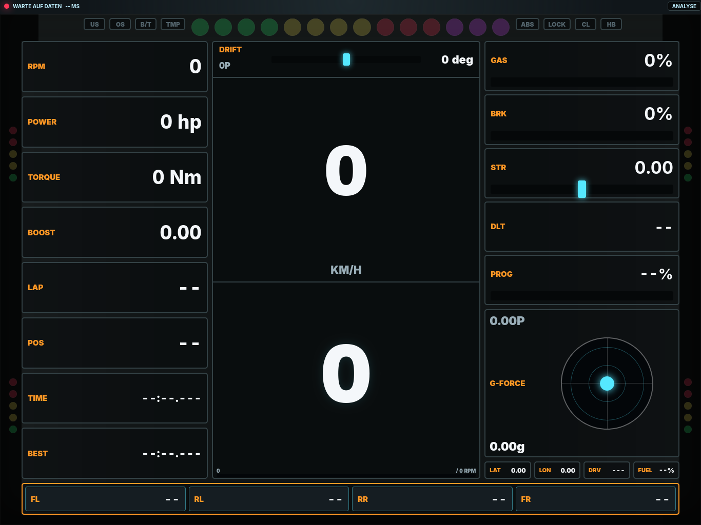

# forza-tacho

A self-contained telemetry dashboard for Forza Horizon 6.  
Open a browser, point Forza at your PC's IP, and get a real-time tachometer with a shift indicator that **learns the optimal shift point for every car you drive**.



## Features

- **Adaptive shift light** — not just "shift at X% of max RPM". The app learns each car's actual power curve at full throttle and calculates the RPM where shifting to the next gear gives more power.
- **Rev limiter detection** — recognises the characteristic oscillation at the limiter and uses it to refine the shift point automatically.
- **Session recorder** — every drive is saved as a JSONL file with speed, RPM, G-forces, lap times and more.
- **Analytics dashboard** — browse past sessions and view per-car power curves in the browser.
- **Single binary** — the web frontend is embedded at compile time. Nothing to install or copy alongside the executable.
- **Works on any device** — open the dashboard on a phone or tablet on the same WiFi network. Installable as a PWA.
- **Cross-platform** — native Windows `.exe` available; runs on Linux and macOS from source.

## Performance

Forza streams telemetry at **60 packets/second** (~324 bytes each). forza-tacho is built to handle this with negligible overhead:

| Metric | Value |
|--------|-------|
| Processing time per packet | **< 1 ms** (parse + shift math + WebSocket push) |
| Resident memory (steady state) | **~10–15 MB** (Tokio runtime + embedded web assets) |
| CPU usage during active play | **< 1 %** on any modern CPU |
| Disk writes | **Only on power curve updates** (~every 0.3 s during learning, idle at cruise) |
| External dependencies at runtime | **Zero** — single binary, no database, no network calls |

The hot path per packet is pure arithmetic (fixed-offset byte reads) and in-memory JSON operations behind a single mutex. Disk I/O is intentionally rare: saves happen every 20 samples during learning and are atomic (write-to-temp then rename). The release binary is compiled with `opt-level = 3`, LTO, and a single codegen unit.

## Quick start

### 1. Enable Data Out in Forza

Go to **Settings → HUD and Gameplay → Data Out** and set:

| Setting | Value |
|---|---|
| Data Out | **On** |
| Data Out IP Address | your PC's local IP (e.g. `192.168.1.42`) |
| Data Out IP Port | **5300** |
| Data Out Packet Format | **Car Dash** |

### 2. Run the app

**Windows** — download `forza-tacho.exe` from the releases page and double-click it.  
A console window will print the URL to open.

**Linux / macOS**
```
cargo run --release
```

### 3. Open the dashboard

The console will print something like:
```
Web dashboard listening on 0.0.0.0:8765
Open: http://127.0.0.1:8765
Open: http://192.168.1.42:8765
```

Open that URL in a browser on any device on the same network.

## Command-line options

```
forza-tacho [OPTIONS]

Options:
  --http-host <HOST>      Address to bind the web server to [default: 0.0.0.0]
  --http-port <PORT>      Web server port [default: 8765]
  --udp-host <HOST>       Address to listen for Forza UDP packets [default: 0.0.0.0]
  --udp-port <PORT>       UDP port to listen on [default: 5300]
  --demo                  Run a simulated car instead of waiting for Forza
  --inspect               Log raw UDP packets to disk for debugging
  --inspect-dir <DIR>     Directory for packet logs [default: logs]
  --inspect-every <N>     Log every Nth packet [default: 30]
  --shift-cache-log       Write shift decisions to a JSONL log file
  --shift-cache-log-dir   Directory for shift logs [default: logs]
  --limiter-log           Print limiter-bounce detection events to stdout
  -h, --help              Print help
```

## Building from source

You need [Rust](https://rustup.rs/) installed.

```bash
# debug build (static files served live from disk — good for frontend work)
cargo run

# optimised release build
cargo build --release
```

### Cross-compiling for Windows (from Linux)

```bash
rustup target add x86_64-pc-windows-gnu
sudo dnf install mingw64-gcc        # Fedora / RHEL
# sudo apt install gcc-mingw-w64    # Debian / Ubuntu

cargo build --release --target x86_64-pc-windows-gnu
# output: target/x86_64-pc-windows-gnu/release/forza-tacho.exe
```

The `.exe` is fully self-contained. No extra files needed.

## Data storage

All data is written next to the executable:

```
forza-tacho(.exe)
data/
  power_curves.json     ← learned shift points, one entry per car
  drive_sessions/       ← one .jsonl file per session
logs/                   ← optional, only with --inspect or --shift-cache-log
```

The `data/` folder is created automatically on first run. Deleting it resets all learned data.

## How the shift system works

The shift indicator goes through several stages as you drive. Each stage is more precise than the last, and all learned data is stored per car so it is immediately available next time you drive the same vehicle.

### Stage 1 — Safety fallback (first drive, no data yet)

Before any real data exists, the app estimates the rev limit conservatively at **94 % of Forza's reported `maxRpm`**. The shift warning fires at this RPM minus a lead gap proportional to the usable RPM band. This intentionally warns a little early — better to shift slightly before the power drops than to hit the limiter on the first lap.

Low gears (1–3) get their own tighter safety ratios (98–99 % of the limit) and slightly longer lead times, because RPM builds fastest there and the penalty for hitting the limiter is worst.

### Stage 2 — Observing the real rev limit

Every time you drive at high RPM in a forward gear the app tracks the highest RPM it has actually seen for that car. This *observed limit* replaces the conservative estimate as soon as real data arrives, and is capped at **97 % of `maxRpm`** to guard against a single RPM spike collapsing the safety margin. The observed limit is persisted between sessions and immediately in effect the next time you drive.

### Stage 3 — Limiter bounce detection

If you hold full throttle at the rev limit, Forza's engine simulation oscillates RPM in a characteristic pattern: rapid alternating rises and drops of 30–400 RPM around a fixed ceiling. The app detects this by counting *direction reversals*:

1. Track the local peak while RPM is rising.
2. Once RPM drops ≥ 30 RPM from that peak (but < 400 RPM — larger drops are upshifts, not bounces), record a reversal.
3. Track the local trough on the falling edge, reverse again when RPM rises ≥ 30 RPM.
4. After **3 reversals within 1 second**, the limiter is confirmed. The highest RPM seen in that window becomes the new `maxObservedRpm`.

If the confirmed limiter is more than 1.5 % *lower* than what was previously stored (e.g. you were driving a different tune earlier), the shift cache for that car is marked dirty and all shift points are recalculated using the corrected limit.

### Stage 4 — Power curve learning

On every full-throttle pass (throttle ≥ 99 %, brake ≤ 2 %) the app samples the engine's power output and groups it into **100-RPM buckets**. Each bucket keeps the *maximum* power seen at that RPM band — partial throttle lifts and transmission loss noise are naturally filtered out because they always produce lower readings. Torque is recorded the same way.

The curve is stored as a JSON map of `rpm → { power, torque, samples }`. A bucket is only considered reliable once it has at least 2 samples. At least **6 filled buckets** are required before the learned shift algorithm activates.

The curve is saved to disk every 20 samples during learning and whenever a better power reading is found for a bucket that already had data. Saves are atomic: written to a `.tmp` file and then renamed, so a crash during a write never corrupts the stored curve.

### Stage 5 — Gear drop ratio learning

The optimal shift point depends on knowing exactly how much RPM drops when you upshift. Forza's gear ratios are not exposed directly, so the app *measures* them from your actual shifts.

When an upshift is detected (gear number increases by exactly 1 within 0.8 seconds), the app records:

```
drop_ratio = rpm_after_shift / rpm_before_shift
```

Ratios outside 0.35–0.92 are discarded (too small = measurement artifact, too large = RPM hasn't settled yet — the app keeps waiting). Valid ratios are averaged with equal weight over all observed upshifts for that gear transition. A running weighted mean is used so later, more accurate samples refine earlier estimates without discarding them.

### Stage 6 — Optimal shift point calculation

Once both the power curve (≥ 6 buckets) and at least one gear drop ratio are available, the app computes the optimal shift RPM for each gear:

1. Find the **power peak RPM** in the current gear's curve.
2. For every RPM point at or above the peak (scanning upward), simulate an upshift:
   - `rpm_after_shift = current_rpm × drop_ratio`
   - Look up the power at `rpm_after_shift` via linear interpolation.
3. The first RPM where `power_after_shift ≥ current_power × 1.005` is the shift point.  
   The 0.5 % threshold prevents premature shifts on flat power curves (electric cars, broad torque plateaus, noisy data).
4. If no such point exists below the safety limit, the safety limit itself is returned — the car has no meaningful power advantage from shifting, so delay as long as safe.

This means the shift light fires at the *real* power-optimal RPM for that specific car and tune — not a fixed percentage of the tacho maximum.

### Stage 7 — Dynamic shift warning (lead time)

The shift indicator doesn't fire exactly at the target RPM — it fires *early* to compensate for reaction time and the time it takes RPM to climb to the shift point.

The lead is computed from a smoothed measurement of the current **RPM rise rate** (in RPM/s), tracked separately per gear. Lead time defaults to **200 ms** and is slightly longer in gears 1–2 where RPM builds fastest.

```
warning_rpm = shift_rpm − clamp(rpm_rate × lead_seconds, 100, 800)
```

If the RPM rise rate is outside a plausible range (350–14 000 RPM/s) — e.g. you're cruising at part throttle — a fallback gap of 1.2 % of the shift RPM (minimum 100 RPM, maximum 220 RPM) is used instead.

### Cache, validation and profile detection

Computed shift points are cached so the shift math doesn't rerun on every packet. A cached point is *validated* live: while driving near the warning RPM at full throttle, the measured power is compared against the stored curve. If the deviation exceeds 15 %, the cache entry is invalidated and recomputed. If it stays within 5 %, the entry is marked *validated* and no further checks are needed.

If you switch cars (or change a tune significantly), the app detects this via RPM signatures:
- Forza's `maxRpm` and `idleRpm` must match the stored values within 1 % / 25 % respectively.
- If a stored power bucket reads more than 25 % differently under the same conditions, the entire curve is reset.

Car identity is keyed on `ordinal:performanceIndex`, so the same car at different PI ratings gets separate curves.

## AI

Parts of this project were developed with the help of AI tools — in particular the shift-learning algorithm, limiter-bounce detection, and test suite. All generated code was reviewed and integrated by the author.

- [Claude](https://claude.ai) (Anthropic) — via Claude Code
- [Codex](https://openai.com/codex) (OpenAI) — via GitHub Copilot / GitHub Codex

## License

MIT — see [LICENSE](LICENSE).
